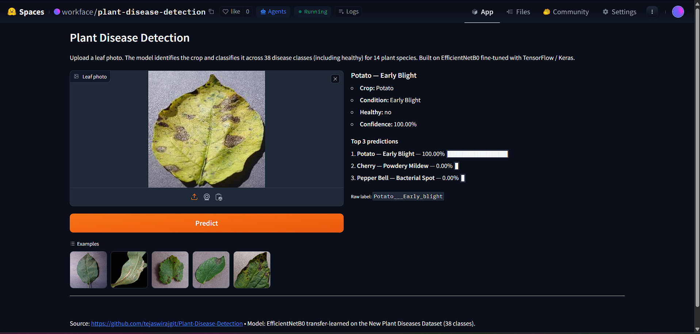
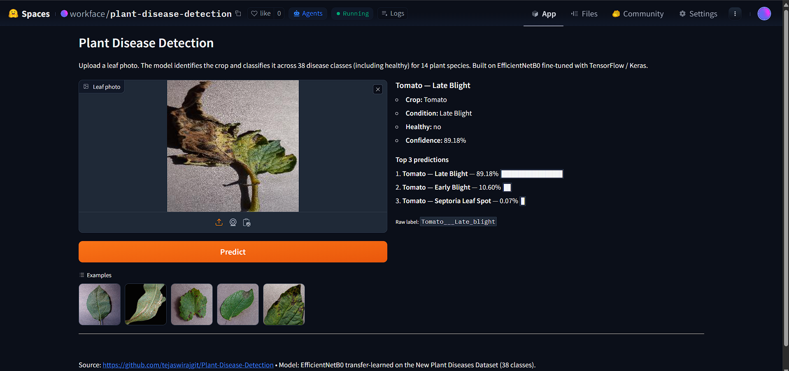
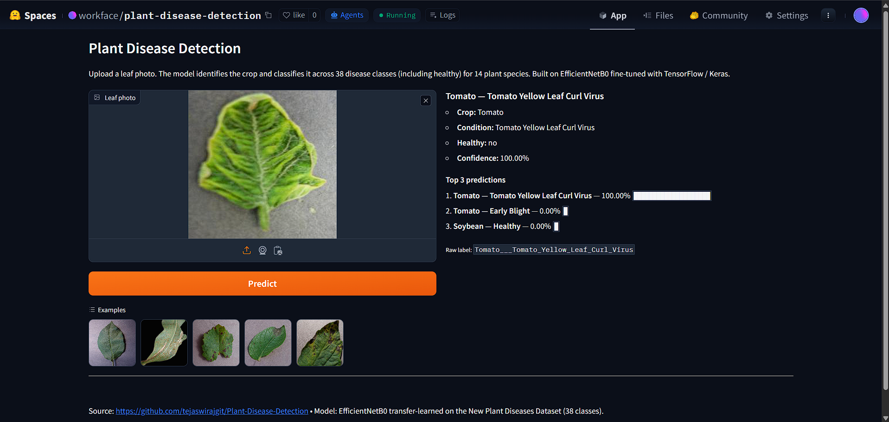

<div align="center">

# Plant Disease Detection

**AI-powered plant disease detection system using deep learning and computer vision.**

[](https://huggingface.co/spaces/workface/plant-disease-detection)
[](https://www.python.org/)
[](https://www.tensorflow.org/)
[](https://gradio.app/)
[](LICENSE)
[](#model-details)

</div>

---

## Overview

Plant Disease Detection is an end-to-end deep-learning pipeline that classifies a leaf photograph into one of **38 disease classes spanning 14 crop species** — from **Apple Scab** to **Tomato Yellow Leaf Curl Virus**. The model is a **transfer-learned EfficientNetB0** fine-tuned on the [New Plant Diseases Dataset](https://www.kaggle.com/datasets/vipoooool/new-plant-diseases-dataset) (~88,000 images), reaching **~99.84% validation accuracy** on the reference run.

The repo ships everything needed to reproduce the model and serve it: the **training notebook**, an **inference package**, an **export script**, and a **Gradio web app** that is deployed live on Hugging Face Spaces.

> **Try it now without installing anything:** [https://huggingface.co/spaces/workface/plant-disease-detection](https://huggingface.co/spaces/workface/plant-disease-detection)

---

## Features

- **38-class multi-disease classifier** across 14 crops (Apple, Tomato, Grape, Corn, Potato, Pepper, Strawberry, Cherry, Peach, Soybean, Squash, Raspberry, Blueberry, Orange).
- **Transfer learning with EfficientNetB0** — ImageNet-pretrained backbone, last 20 layers fine-tuned.
- **Production-quality inference module** — thread-safe lazy loading, structured prediction output (top-1 + top-3 + healthy flag + raw label).
- **Interactive Gradio UI** with bundled example leaves and a top-3 confidence breakdown.
- **Clean separation of concerns** — training notebook, export script, and runtime app are decoupled.
- **Cold-boot weight downloading** — large model artifacts live in a GitHub Release rather than the repo, keeping clones fast.
- **Defensive Gradio shimming** for known upstream JSON-schema bugs in `gradio_client` 4.44.x.
- **Reproducible setup** — pinned `requirements.txt` and a `.env.example` for Kaggle credentials.

---

## Architecture & Workflow

```text
                ┌─────────────────────────┐
                │  Kaggle: 88k leaf imgs  │
                │  38 classes, 14 crops   │
                └─────────────┬───────────┘
                              │  download via Kaggle API
                              ▼
   ┌───────────────────────────────────────────────────────────┐
   │  Plant Leaf Disease Detection.ipynb                       │
   │  ─ load datasets (224×224, batch 32, categorical)         │
   │  ─ build EfficientNetB0 + GAP + Dense(38, softmax)        │
   │  ─ fine-tune last 20 layers (Adam, categorical CE)        │
   │  ─ EarlyStopping / ReduceLROnPlateau / ModelCheckpoint    │
   └─────────────┬─────────────────────────────────────────────┘
                 │  trained weights
                 ▼
        ┌─────────────────────┐         ┌──────────────────────┐
        │  export_model.py    │  ────►  │  GitHub Release      │
        │  → .keras + classes │         │  plant_disease_model │
        └─────────┬───────────┘         └──────────┬───────────┘
                  │                                │
                  │   app/class_names.json         │  cold-boot
                  │   (committed)                  │  download
                  ▼                                ▼
         ┌──────────────────────────────────────────────┐
         │  app.py  (Gradio UI)                         │
         │   └─ app/predict.py  → top-1, top-3, healthy │
         └──────────────────────────────────────────────┘
                              │
                              ▼
                ┌─────────────────────────┐
                │   🤗 Hugging Face Space  │
                └─────────────────────────┘
```

### Model details

| Component        | Value                                                      |
| ---------------- | ---------------------------------------------------------- |
| Backbone         | EfficientNetB0 (ImageNet weights, `include_top=False`)     |
| Head             | `GlobalAveragePooling2D` → `Dense(38, softmax)`            |
| Input            | 224 × 224 × 3, batch size 32, `label_mode='categorical'`   |
| Fine-tuning      | Last 20 backbone layers unfrozen                            |
| Loss / optimizer | `categorical_crossentropy` / Adam                           |
| Callbacks        | `EarlyStopping(patience=3)`, `ReduceLROnPlateau(0.2, p=2)`, `ModelCheckpoint(save_best_only=True)`, `TensorBoard` |
| Reference val acc| **~99.84%**                                                 |

---

## Installation

> Python **3.10+** recommended (TensorFlow 2.12 supports up to 3.11).

```bash
# 1. Clone
git clone https://github.com/apoorvrajdev/plant-disease-detection.git
cd plant-disease-detection

# 2. Create a virtual environment
python -m venv .venv
.venv\Scripts\activate           # Windows PowerShell
# source .venv/bin/activate      # macOS / Linux

# 3. Install dependencies
pip install -r requirements.txt

# 4. (Optional) Provide Kaggle credentials for dataset download
copy .env.example .env           # Windows
# cp .env.example .env           # macOS / Linux
# then fill in KAGGLE_USERNAME and KAGGLE_KEY
```

---

## Usage

### Option A — Run the live demo (no install)

Open the Hugging Face Space, drop a leaf photo, and read the top-3 predictions:
**[https://huggingface.co/spaces/workface/plant-disease-detection](https://huggingface.co/spaces/workface/plant-disease-detection)**

### Option B — Run the Gradio app locally

```bash
pip install -r requirements.txt
python export_model.py        # only needed if plant_disease_model.keras isn't already on disk
python app.py                 # opens http://127.0.0.1:7860
```

If `plant_disease_model.keras` is missing, the app will automatically pull it from the GitHub Release on first launch.

### Option C — Retrain from scratch

1. Download the dataset:

   ```bash
   pip install kaggle
   kaggle datasets download -d vipoooool/new-plant-diseases-dataset --unzip -p .
   ```

   You'll need a Kaggle API token (`~/.kaggle/kaggle.json`, or `KAGGLE_USERNAME` / `KAGGLE_KEY` env vars — see [`.env.example`](.env.example)).

2. Open `Plant Leaf Disease Detection.ipynb` in Jupyter or VS Code and execute cells top-to-bottom.

   > ⚠ **Patch the dataset paths first.** The notebook uses the original training-machine paths (`E:/MINICONDA_FILES/...`). Replace them with the in-repo layout:
   >
   > ```python
   > train_dir = 'New Plant Diseases Dataset/New Plant Diseases Dataset(Augmented)/train'
   > test_dir  = 'New Plant Diseases Dataset/New Plant Diseases Dataset(Augmented)/valid'
   > data_dir  = 'New Plant Diseases Dataset/test/test'
   > ```

3. Once the notebook finishes, `python export_model.py` packages the trained weights into `plant_disease_model.keras` and writes the canonical `app/class_names.json`.

### Programmatic inference

```python
from PIL import Image
from app.predict import predict

img = Image.open("examples/Tomato___Early_blight.jpg")
result = predict(img)

print(result["crop"], "—", result["condition"], f"({result['confidence']*100:.2f}%)")
# Tomato — Early Blight (99.83%)
```

`predict()` returns a structured dict:

```python
{
  "crop":       "Tomato",
  "condition":  "Early Blight",
  "is_healthy": False,
  "confidence": 0.9983,
  "top_3":      [{"crop": ..., "condition": ..., "prob": ...}, ...],
  "raw_label":  "Tomato___Early_blight",
}
```

---

## Sample Predictions

Three real predictions from the live Space, spanning three different diseases across two crops:

**Diseased Potato leaf → `Potato — Early Blight` at 100.00% confidence**



**Heavily blighted Tomato leaf → `Tomato — Late Blight` at 89.18% confidence**



> Runner-up on this case was *Tomato — Early Blight* at 10.60% — a sensible Tomato/Tomato confusion since both diseases produce dark lesions. The top-3 panel always exposes these alternatives so you can sanity-check edge cases.

**Tomato leaf with curling and yellowing → `Tomato — Tomato Yellow Leaf Curl Virus` at 100.00% confidence**



> TYLCV is a whitefly-transmitted virus that causes severe yield loss in commercial tomato production — one of the more economically important diseases in the dataset.

---

## Screenshots

> Drop additional UI screenshots into [`docs/`](docs/) and reference them here.

| | |
| :---: | :---: |
|  |  |
| *Potato — Early Blight* | *Tomato — Late Blight* |

---

## Dataset

This project trains on the **[New Plant Diseases Dataset (Augmented)](https://www.kaggle.com/datasets/vipoooool/new-plant-diseases-dataset)** by [vipoooool](https://www.kaggle.com/vipoooool) on Kaggle — about **88,000 labelled leaf images** spanning **38 classes across 14 plant species**. It is an augmented derivative of the [PlantVillage](https://github.com/spMohanty/PlantVillage-Dataset) dataset.

The dataset is **not committed** to this repo (see [`.gitignore`](.gitignore)).

---

## Project Layout

```text
.
├── LICENSE                              # MIT
├── README.md                            # this file
├── requirements.txt                     # pinned deps (TF 2.12 + Gradio + HF Hub)
├── .env.example                         # template for Kaggle creds (copy to .env)
├── .gitignore                           # excludes dataset, weights, secrets, caches
├── Plant Leaf Disease Detection.ipynb   # main training pipeline notebook
├── export_model.py                      # one-shot export of .keras + class_names.json
├── app.py                               # Gradio entry point (HF Space app_file)
├── app/                                 # inference package
│   ├── __init__.py
│   ├── class_names.json                 # canonical 38-class order (committed)
│   ├── model_utils.py                   # lazy weight download from GH Release
│   └── predict.py                       # thread-safe load + structured predict()
├── examples/                            # bundled leaf photos shown in the Gradio UI
├── docs/                                # README screenshots (sample predictions)
└── New Plant Diseases Dataset/          # gitignored — Kaggle data
```

---

## Future Improvements

- [ ] **Grad-CAM / saliency maps** to visualise *why* the model made a prediction.
- [ ] **TensorFlow Lite / ONNX export** for on-device mobile inference.
- [ ] **Confusion-matrix dashboard** + per-class precision/recall on a held-out test set.
- [ ] **Test-time augmentation (TTA)** to harden predictions on noisy field photos.
- [ ] **Robustness study** on photos with cluttered backgrounds, multiple leaves, and partial occlusion (current model is trained on isolated leaves on a plain background).
- [ ] **Active-learning loop** — flag low-confidence predictions for human re-labelling.
- [ ] **Severity estimation** in addition to disease classification (e.g. % leaf area affected).
- [ ] **REST API** wrapper (FastAPI) alongside the Gradio UI for programmatic integration.
- [ ] **CI workflow** — automated lint, unit tests on `predict()`, and a smoke-test of the Gradio app.
- [ ] **Multilingual UI** for use by farmers in regional languages.

---

## Contributors

> *Originally developed as a collaborative university project by Apoorv Raj and Tejaswi Raj.*

| Contributor | Role |
| ----------- | ---- |
| **Apoorv Raj** ([@apoorvrajdev](https://github.com/apoorvrajdev)) | Co-developer — model training, inference pipeline, deployment |
| **Tejaswi Raj** | Co-developer — data preparation, notebook authoring, evaluation |

Pull requests and issues are welcome. If you build on this work, a citation or a link back is appreciated.

---

## Acknowledgements

- **Dataset:** [New Plant Diseases Dataset (Augmented)](https://www.kaggle.com/datasets/vipoooool/new-plant-diseases-dataset) by *vipoooool* on Kaggle, derived from [PlantVillage](https://github.com/spMohanty/PlantVillage-Dataset).
- **Backbone:** [EfficientNet](https://arxiv.org/abs/1905.11946) (Tan & Le, 2019).
- **Frameworks:** [TensorFlow / Keras](https://www.tensorflow.org/), [Gradio](https://gradio.app/), [Hugging Face Spaces](https://huggingface.co/spaces).

---

## License

[MIT License](LICENSE) © 2026 Apoorv Raj and Tejaswi Raj.
